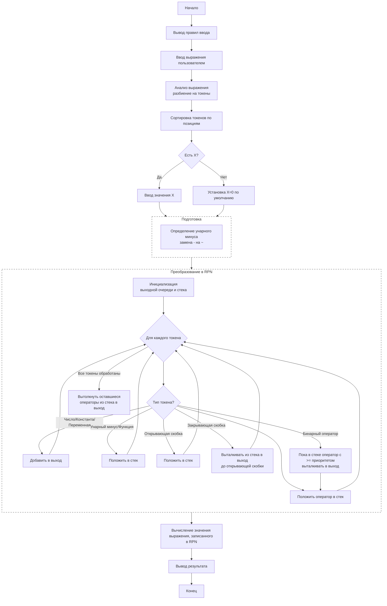

# Отчет к домашнему заданию №3 "Создание консольного калькулятора"

## Цели
- Разработать программу-калькулятор для вычисления математических выражений, которые вводит пользователь
- Реализовать алгоритм для перевода арифметических выражений из инфиксной записи в постфиксную (обратную польскую нотацию)
- Обеспечить поддержку различных операторов и функций
- Создать удобный и понятный интерфейс для взаимодействия с пользователем

## Задачи работы
- Реализовать лексический анализатор для разбора математических выражений на отдельные составляющие (токены)
- Разработать алгоритм преобразования инфиксной записи в постфиксную
- Реализовать алгоритм для вычисления значения выражения в постфиксной нотации
- Реализовать корректную обработку всех компонентов арифметического выражений (чисел, констант, переменных, операторов, функций, скобок)

## Теоретическая база
Обратная польская нотация (Reverse Polish Notation - RPN) — математическая нотация, в которой операторы записываются после операндов. В отличие от традиционной инфиксной нотации, где операторы записываются между операндами (например, 2+3), в RPN выражение будет представлено в виде 2 3 +

### Преимущества RPN
- Устраняет необходимость в скобках для определения приоритета операций
- Позволяет реализовать алгоритм для вычисления с использованием стека
- Исключает неоднозначность в порядке выполнения арифметических операций
- Легко реализуется в вычислительных системах

## Описание принципа работы

Программа начинает работу с приветственного сообщения, информирующего пользователя о поддерживаемых операциях. После ввода выражения происходит его токенизация — разбиение на отдельные элементы (числа, операторы, функции, скобки, переменные) с использованием регулярных выражений. Все найденные токены сохраняются вместе с их позициями в исходной строке.

Далее токены сортируются по позициям для восстановления исходного порядка. Программа анализирует наличие унарных минусов, преобразуя их в специальные токены. Затем выполняется преобразование в постфиксную нотацию с помощью алгоритма сортировочной станции, использующего стек для временного хранения операторов.

Если в выражении обнаружена переменная X, программа запрашивает ее значение у пользователя. Финальный этап - вычисление результата путем обработки постфиксной записи с использованием стека для промежуточных результатов.

Программа поддерживает следующие элементы выражений:
- Базовые арифметические операции (+, -, *, /)
- Математические функции (sin, cos, tg, ctg, exp)
- Константы (PI, E)
- Переменную X
- Унарный минус и скобки для задания приоритета

## Для наглядности продемонстрируем принцип работы программы с помощью блок-схемы ниже

## Заключение

В ходе работы был успешно разработан консольный калькулятор, способный обрабатывать сложные математические выражения. Программа демонстрирует эффективное применение алгоритмов обработки математических выражений, включая лексический анализ и преобразование между нотациями.

Реализованная программа корректно обрабатывает приоритеты операций, унарные операции, математические функции и переменные.
